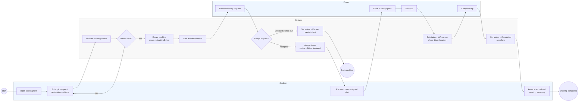

# Diagram 4 – Activity Diagram (swimlanes): Request a ride until the trip ends

```mermaid
flowchart LR

START(("Start"))

subgraph Student["Student"]
    S1["Open booking form"]
    S2["Enter pickup point,<br/>destination and time"]
    S3["Receive driver assigned alert"]
    S4["Arrive at school and<br/>view trip summary"]
end

subgraph System["System"]
    SYS1["Validate booking details"]
    D1{"Details valid?"}
    SYS2["Create booking<br/>status = AwaitingDriver"]
    SYS3["Alert available drivers"]
    D2{"Accept request?"}
    SYS4["Set status = Expired<br/>alert student"]
    SYS5["Assign driver<br/>status = DriverAssigned"]
    SYS6["Set status = InProgress<br/>share driver location"]
    SYS7["Set status = Completed<br/>save fare"]
end

subgraph Driver["Driver"]
    DRI1["Review booking request"]
    DRI2["Drive to pickup point"]
    DRI3["Start trip"]
    DRI4["Complete trip"]
end

END1(("End: no driver"))
END2(("End: trip completed"))

START --> S1
S1 --> S2
S2 --> SYS1
SYS1 --> D1

D1 -->|No| S2
D1 -->|Yes| SYS2
SYS2 --> SYS3
SYS3 --> DRI1
DRI1 --> D2

D2 -->|Declined / timed out| SYS4
SYS4 --> END1

D2 -->|Accepted| SYS5
SYS5 --> S3
S3 --> DRI2
DRI2 --> DRI3
DRI3 --> SYS6
SYS6 --> DRI4
DRI4 --> SYS7
SYS7 --> S4
S4 --> END2

style Student fill:#eef6ff,stroke:#555
style System fill:#f8f8f8,stroke:#555
style Driver fill:#eef6ff,stroke:#555
```
