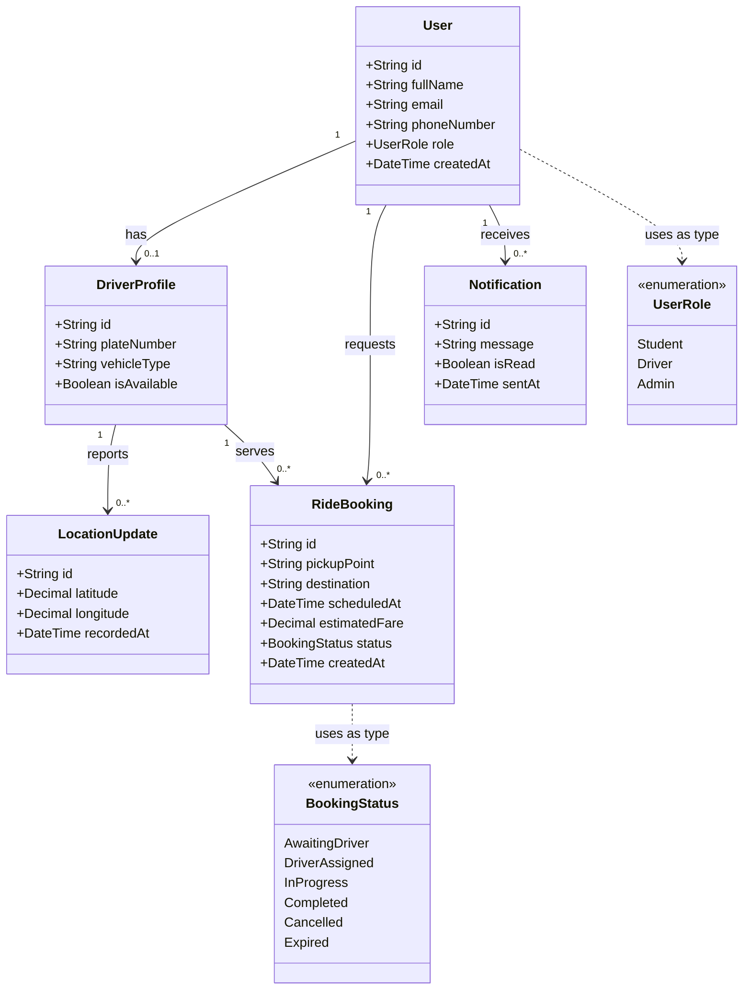

# Diagram 6 – Class Diagram: SRJ Ride Booking domain model

```mermaid
classDiagram

class User {
    +String id
    +String fullName
    +String email
    +String phoneNumber
    +UserRole role
    +DateTime createdAt
}

class DriverProfile {
    +String id
    +String plateNumber
    +String vehicleType
    +Boolean isAvailable
}

class RideBooking {
    +String id
    +String pickupPoint
    +String destination
    +DateTime scheduledAt
    +Decimal estimatedFare
    +BookingStatus status
    +DateTime createdAt
}

class LocationUpdate {
    +String id
    +Decimal latitude
    +Decimal longitude
    +DateTime recordedAt
}

class Notification {
    +String id
    +String message
    +Boolean isRead
    +DateTime sentAt
}

class UserRole {
    <<enumeration>>
    Student
    Driver
    Admin
}

class BookingStatus {
    <<enumeration>>
    AwaitingDriver
    DriverAssigned
    InProgress
    Completed
    Cancelled
    Expired
}

User "1" --> "0..1" DriverProfile : has
DriverProfile "1" --> "0..*" LocationUpdate : reports
DriverProfile "1" --> "0..*" RideBooking : serves
User "1" --> "0..*" RideBooking : requests
User "1" --> "0..*" Notification : receives

User ..> UserRole : uses as type
RideBooking ..> BookingStatus : uses as type
```
