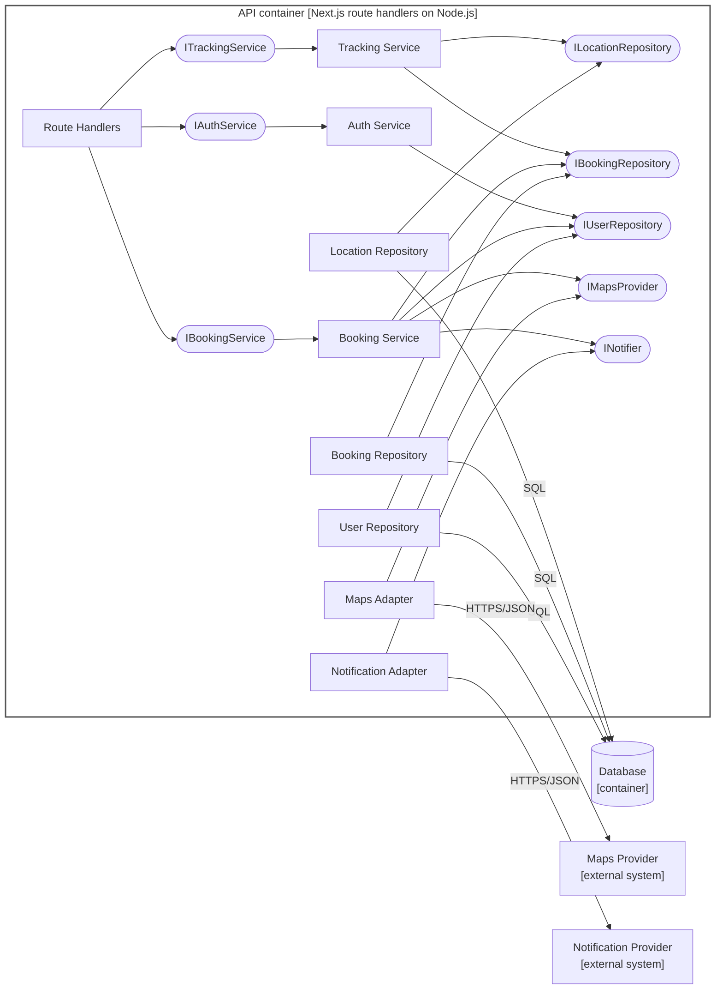

# Diagram 9 – UML Component: API container (provided and required interfaces)

```mermaid
flowchart LR

subgraph API["API container [Next.js route handlers on Node.js]"]

    RH["Route Handlers"]

    TS["Tracking Service"]
    AS["Auth Service"]
    BS["Booking Service"]

    LR["Location Repository"]
    BR["Booking Repository"]
    UR["User Repository"]

    MA["Maps Adapter"]
    NA["Notification Adapter"]

    ITS(["ITrackingService"])
    IAS(["IAuthService"])
    IBS(["IBookingService"])

    ILR(["ILocationRepository"])
    IBR(["IBookingRepository"])
    IUR(["IUserRepository"])

    IMP(["IMapsProvider"])
    INOT(["INotifier"])

end

DB[("Database<br/>[container]")]
MAPS["Maps Provider<br/>[external system]"]
NOTIFY["Notification Provider<br/>[external system]"]

RH --> ITS
RH --> IAS
RH --> IBS

ITS --> TS
IAS --> AS
IBS --> BS

TS --> ILR
TS --> IBR

AS --> IUR

BS --> IBR
BS --> IUR
BS --> IMP
BS --> INOT

LR --> ILR
BR --> IBR
UR --> IUR

MA --> IMP
NA --> INOT

LR -->|"SQL"| DB
BR -->|"SQL"| DB
UR -->|"SQL"| DB

MA -->|"HTTPS/JSON"| MAPS
NA -->|"HTTPS/JSON"| NOTIFY

style API fill:white,stroke:#555,stroke-width:2px
```
