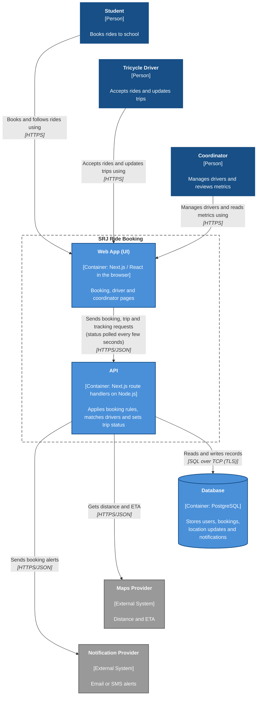

# Diagram 2 – C4 Container: SRJ Student Ride Booking (MVP)

```mermaid
flowchart TB

%% =========================
%% ACTORS
%% =========================

student["<b>Student</b><br/>[Person]<br/><br/>Books rides to school"]

driver["<b>Tricycle Driver</b><br/>[Person]<br/><br/>Accepts rides and updates trips"]

coordinator["<b>Coordinator</b><br/>[Person]<br/><br/>Manages drivers and reviews metrics"]

%% =========================
%% SRJ SYSTEM BOUNDARY
%% =========================

subgraph SRJ["<b>SRJ Ride Booking</b><br/>[Software System]"]

    web["<b>Web App (UI)</b><br/><br/>[Container: Next.js / React in the browser]<br/><br/>Booking, driver and coordinator pages"]

    api["<b>API</b><br/><br/>[Container: Next.js route handlers on Node.js]<br/><br/>Applies booking rules, matches drivers and sets trip status"]

end

%% =========================
%% EXTERNAL SYSTEMS
%% =========================

database[("<b>Database</b><br/><br/>[Container: PostgreSQL]<br/><br/>Stores users, bookings,<br/>location updates and notifications")]

maps["<b>Maps Provider</b><br/><br/>[External System]<br/><br/>Distance and ETA"]

notification["<b>Notification Provider</b><br/><br/>[External System]<br/><br/>Email or SMS alerts"]

%% =========================
%% ACTOR → WEB APP
%% =========================

student -->|"Books and follows rides using<br/><i>[HTTPS]</i>"| web

driver -->|"Accepts rides and updates trips using<br/><i>[HTTPS]</i>"| web

coordinator -->|"Manages drivers and reads metrics using<br/><i>[HTTPS]</i>"| web

%% =========================
%% WEB APP → API
%% =========================

web -->|"Sends booking, trip and tracking requests<br/>(status polled every few seconds)<br/><i>[HTTPS/JSON]</i>"| api

%% =========================
%% API → EXTERNAL SYSTEMS
%% =========================

api -->|"Reads and writes records<br/><i>[SQL over TCP (TLS)]</i>"| database

api -->|"Gets distance and ETA<br/><i>[HTTPS/JSON]</i>"| maps

api -->|"Sends booking alerts<br/><i>[HTTPS/JSON]</i>"| notification

%% =========================
%% LAYOUT HELPERS
%% =========================

student ~~~ driver
driver ~~~ coordinator

database ~~~ maps
maps ~~~ notification

%% =========================
%% STYLING
%% =========================

classDef person fill:#174F86,color:white,stroke:#174F86,stroke-width:2px;
classDef container fill:#4A90D9,color:white,stroke:#174F86,stroke-width:2px;
classDef external fill:#999999,color:white,stroke:#666666,stroke-width:2px;
classDef database fill:#4A90D9,color:white,stroke:#174F86,stroke-width:2px;

class student,driver,coordinator person;
class web,api container;
class maps,notification external;
class database database;

style SRJ fill:white,stroke:#777,stroke-width:2px,stroke-dasharray:8 5
```
