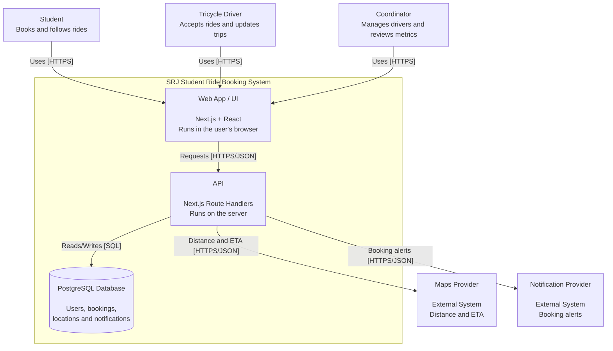

# Diagram 2 — C4 Container

```mermaid
flowchart TB

    Student["Student<br/>Books and follows rides"]
    Driver["Tricycle Driver<br/>Accepts rides and updates trips"]
    Coordinator["Coordinator<br/>Manages drivers and reviews metrics"]

    subgraph SRJ["SRJ Student Ride Booking System"]

        UI["Web App / UI<br/><br/>Next.js + React<br/>Runs in the user's browser"]

        API["API<br/><br/>Next.js Route Handlers<br/>Runs on the server"]

        DB[("PostgreSQL Database<br/><br/>Users, bookings,<br/>locations and notifications")]
    end

    Maps["Maps Provider<br/><br/>External System<br/>Distance and ETA"]

    Notify["Notification Provider<br/><br/>External System<br/>Booking alerts"]

    Student -->|"Uses [HTTPS]"| UI
    Driver -->|"Uses [HTTPS]"| UI
    Coordinator -->|"Uses [HTTPS]"| UI

    UI -->|"Requests [HTTPS/JSON]"| API

    API -->|"Reads/Writes [SQL]"| DB
    API -->|"Distance and ETA [HTTPS/JSON]"| Maps
    API -->|"Booking alerts [HTTPS/JSON]"| Notify
```
