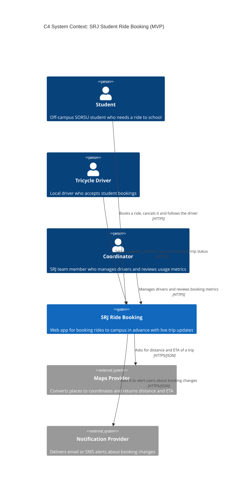

# Diagram 1 – C4 System Context: SRJ Student Ride Booking (MVP)

```mermaid
C4Context

title C4 System Context: SRJ Student Ride Booking (MVP)

UpdateLayoutConfig($c4ShapeInRow="3", $c4BoundaryInRow="1")

Person(student, "Student", "Off-campus SORSU student who needs a ride to school")
Person(driver, "Tricycle Driver", "Local driver who accepts student bookings")
Person(coordinator, "Coordinator", "SRJ team member who manages drivers and reviews usage metrics")

System(srj, "SRJ Ride Booking", "Web app for booking rides to campus in advance with live trip updates")

System_Ext(maps, "Maps Provider", "Converts places to coordinates and returns distance and ETA")
System_Ext(notification, "Notification Provider", "Delivers email or SMS alerts about booking changes")

Rel_D(student, srj, "Books a ride, cancels it and follows the driver", "HTTPS")
Rel_D(driver, srj, "Sets availability, accepts rides and updates trip status", "HTTPS")
Rel_D(coordinator, srj, "Manages drivers and reviews booking metrics", "HTTPS")

Rel_D(srj, maps, "Asks for distance and ETA of a trip", "HTTPS/JSON")
Rel_D(srj, notification, "Asks it to alert users about booking changes", "HTTPS/JSON")
```
