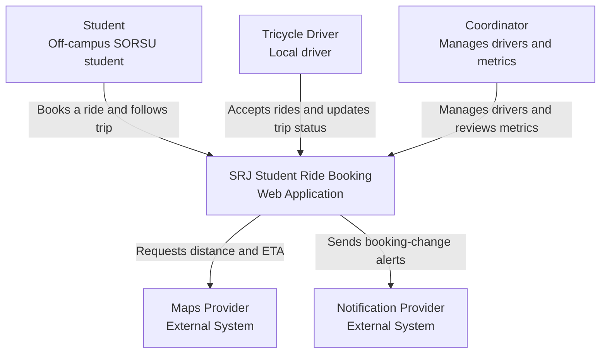

# Diagram 1 — C4 System Context

```mermaid
flowchart TB

    Student["Student<br/>Off-campus SORSU student"]
    Driver["Tricycle Driver<br/>Local driver"]
    Coordinator["Coordinator<br/>Manages drivers and metrics"]

    System["SRJ Student Ride Booking<br/>Web Application"]

    Maps["Maps Provider<br/>External System"]
    Notify["Notification Provider<br/>External System"]

    Student -->|"Books a ride and follows trip"| System
    Driver -->|"Accepts rides and updates trip status"| System
    Coordinator -->|"Manages drivers and reviews metrics"| System

    System -->|"Requests distance and ETA"| Maps
    System -->|"Sends booking-change alerts"| Notify
```
