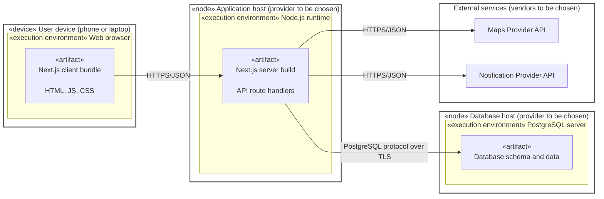

# Diagram 10 – Deployment Diagram (PROVISIONAL)

```mermaid
flowchart LR

subgraph DEVICE["«device» User device (phone or laptop)"]

    subgraph BROWSER["«execution environment» Web browser"]

        CLIENT["«artifact»<br/>Next.js client bundle<br/><br/>HTML, JS, CSS"]

    end

end

subgraph APPHOST["«node» Application host (provider to be chosen)"]

    subgraph NODE["«execution environment» Node.js runtime"]

        SERVER["«artifact»<br/>Next.js server build<br/><br/>API route handlers"]

    end

end

subgraph DBHOST["«node» Database host (provider to be chosen)"]

    subgraph POSTGRES["«execution environment» PostgreSQL server"]

        DATA["«artifact»<br/>Database schema and data"]

    end

end

subgraph EXTERNAL["External services (vendors to be chosen)"]

    MAPS["Maps Provider API"]
    NOTIFY["Notification Provider API"]

end

CLIENT -->|"HTTPS/JSON"| SERVER
SERVER -->|"PostgreSQL protocol over TLS"| DATA
SERVER -->|"HTTPS/JSON"| MAPS
SERVER -->|"HTTPS/JSON"| NOTIFY

style DEVICE fill:white,stroke:#555,stroke-width:2px
style APPHOST fill:white,stroke:#555,stroke-width:2px
style DBHOST fill:white,stroke:#555,stroke-width:2px
style EXTERNAL fill:white,stroke:#555,stroke-width:2px
```

**PROVISIONAL:** generic deployment until hosting/database/external vendors are chosen.

No secrets, hostnames, or IP addresses are shown.
