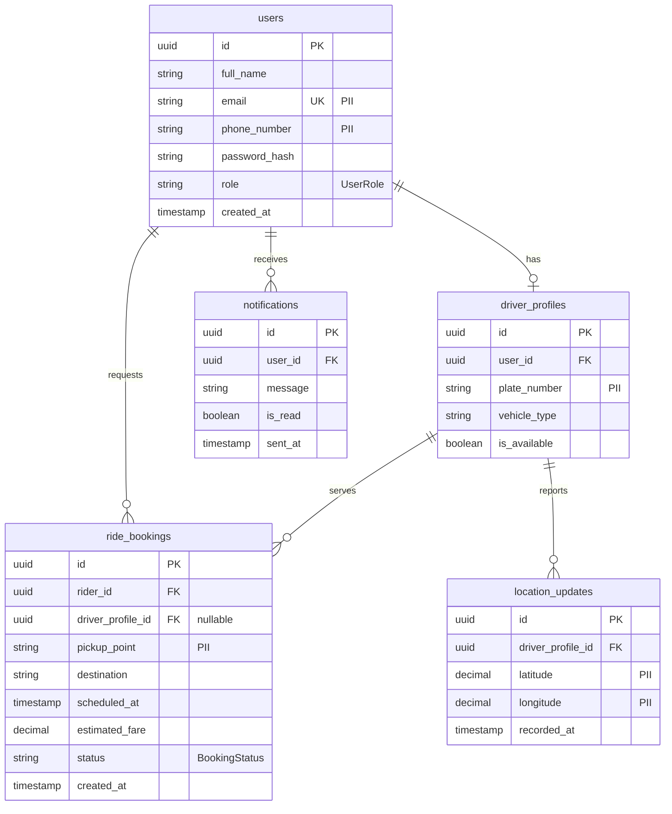

# Diagram 11 – Entity Relationship Diagram (DRAFT)

### Key

- **PK** = Primary Key
- **FK** = Foreign Key
- **UK** = Unique Key
- **PII** = Personal Information; restrict access
- `o` = zero allowed
- `|` = exactly one
- Crow's foot = many
