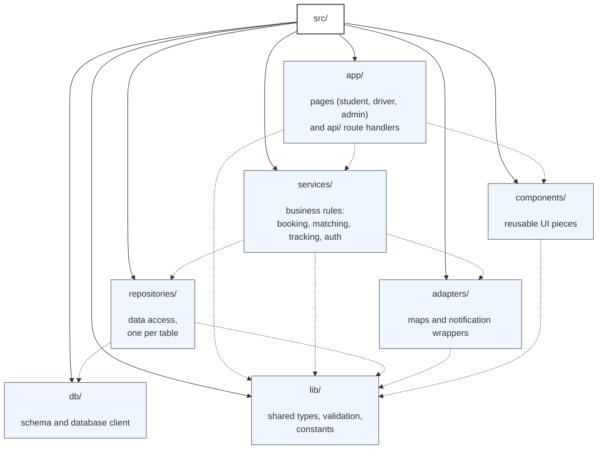

# Diagram 8 – Package Diagram: src/ folders and allowed dependencies

### Layering rule

- Pages/components never import repositories, adapters, or database directly.
- Only API route handlers call services.
- Only services call repositories/adapters.
- Only repositories touch `db`.
- Everyone may use `lib`.
