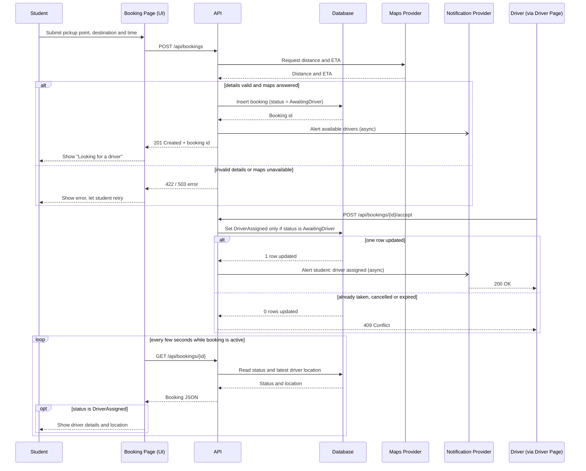

# Diagram 5 – Sequence Diagram: Book a ride, driver accepts, student sees the update

```mermaid
sequenceDiagram

    participant Student
    participant UI as Booking Page (UI)
    participant API
    participant DB as Database
    participant Maps as Maps Provider
    participant Notify as Notification Provider
    participant Driver as Driver (via Driver Page)

    Student->>UI: Submit pickup point, destination and time
    UI->>API: POST /api/bookings
    API->>Maps: Request distance and ETA
    Maps-->>API: Distance and ETA

    alt details valid and maps answered
        API->>DB: Insert booking (status = AwaitingDriver)
        DB-->>API: Booking id
        API-)Notify: Alert available drivers (async)
        API-->>UI: 201 Created + booking id
        UI-->>Student: Show "Looking for a driver"
    else invalid details or maps unavailable
        API-->>UI: 422 / 503 error
        UI-->>Student: Show error, let student retry
    end

    Driver->>API: POST /api/bookings/{id}/accept
    API->>DB: Set DriverAssigned only if status is AwaitingDriver

    alt one row updated
        DB-->>API: 1 row updated
        API-)Notify: Alert student: driver assigned (async)
        Notify-->>Driver: 200 OK
    else already taken, cancelled or expired
        DB-->>API: 0 rows updated
        API-->>Driver: 409 Conflict
    end

    loop every few seconds while booking is active
        UI->>API: GET /api/bookings/{id}
        API->>DB: Read status and latest driver location
        DB-->>API: Status and location
        API-->>UI: Booking JSON

        opt status is DriverAssigned
            UI-->>Student: Show driver details and location
        end
    end
```
