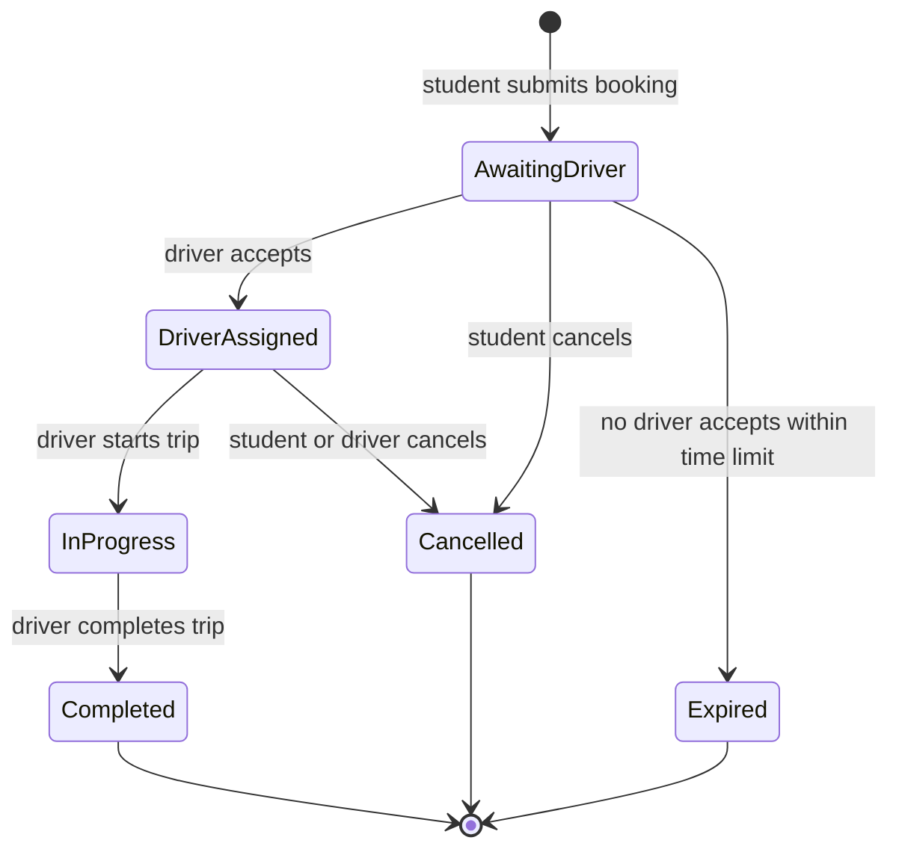

# Diagram 7 – State Machine: RideBooking status

```mermaid
stateDiagram-v2

    [*] --> AwaitingDriver : student submits booking

    AwaitingDriver --> DriverAssigned : driver accepts
    AwaitingDriver --> Cancelled : student cancels
    AwaitingDriver --> Expired : no driver accepts within time limit

    DriverAssigned --> InProgress : driver starts trip
    DriverAssigned --> Cancelled : student or driver cancels

    InProgress --> Completed : driver completes trip

    Completed --> [*]
    Cancelled --> [*]
    Expired --> [*]
```
