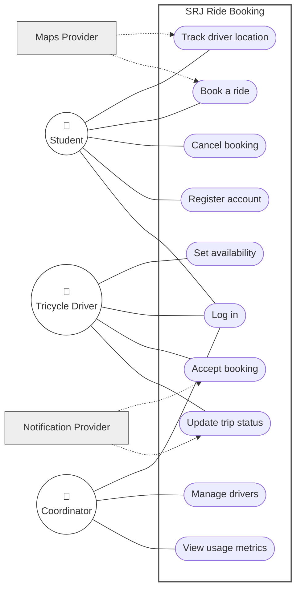

# Diagram 3 – Use Case: SRJ Student Ride Booking (Must-have features)

```mermaid
flowchart LR

Student(("👤<br/>Student"))
Driver(("👤<br/>Tricycle Driver"))
Coordinator(("👤<br/>Coordinator"))
Maps["Maps Provider"]
Notification["Notification Provider"]

subgraph SRJ["SRJ Ride Booking"]

    UC1(["Track driver location"])
    UC2(["Book a ride"])
    UC3(["Cancel booking"])
    UC4(["Register account"])
    UC5(["Set availability"])
    UC6(["Log in"])
    UC7(["Accept booking"])
    UC8(["Update trip status"])
    UC9(["Manage drivers"])
    UC10(["View usage metrics"])

end

Student --- UC1
Student --- UC2
Student --- UC3
Student --- UC4
Student --- UC6

Driver --- UC5
Driver --- UC6
Driver --- UC7
Driver --- UC8

Coordinator --- UC6
Coordinator --- UC9
Coordinator --- UC10

Maps -.-> UC1
Maps -.-> UC2

Notification -.-> UC7
Notification -.-> UC8

style SRJ fill:white,stroke:#555,stroke-width:2px
style Student fill:white,stroke:#333
style Driver fill:white,stroke:#333
style Coordinator fill:white,stroke:#333
style Maps fill:#eee,stroke:#555
style Notification fill:#eee,stroke:#555
```
